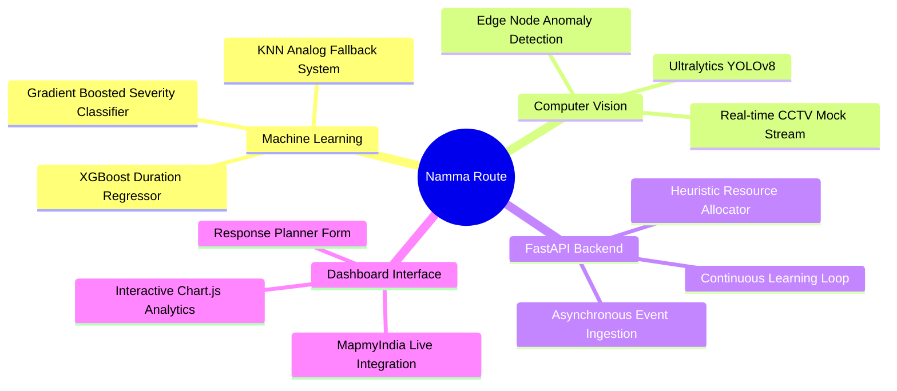
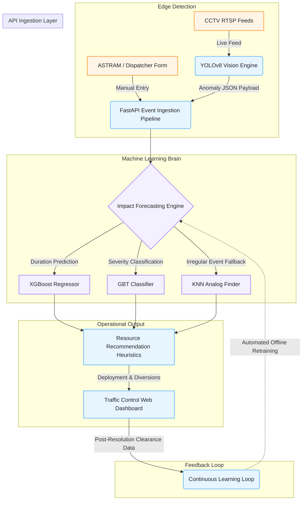

<div align="center">
  

  # Namma Route
  ### Event-Driven Congestion Forecasting & Resource Recommendation System
  
  [](https://huggingface.co/spaces/aynaval2003/namma-route)
  [](https://fastapi.tiangolo.com/)
  [](https://ultralytics.com)
  [](#)
  [](#)
</div>

---

> **Flipkart Gridlock 2.0 Hackathon Prototype** — Namma Route transforms municipal traffic management from a *reactive* operational model to a highly *predictive* Enterprise Decision Support System.

---

##  Live Deployment

The system is deployed globally as a high-performance containerized web application on Hugging Face Spaces. 

👉 **[Access the Live Namma Route Dashboard Here](https://huggingface.co/spaces/aynaval2003/namma-route)**

> [!NOTE]
> *The application requires a Mappls API key to render the geographic map tiles. In production, this is injected securely via Hugging Face Secrets. The live demo has this pre-configured.*

---

## 🛠️ Comprehensive Tech Stack

<div align="center">

| Layer | Technology | Purpose |
| :--- | :--- | :--- |
| **Backend API** | `FastAPI` / `Uvicorn` | Asynchronous REST API serving predictions at <50ms latency. |
| **Machine Learning** | `XGBoost` / `scikit-learn` | Regression & Classification models trained on 8,200+ events. |
| **Computer Vision** | `YOLOv8` / `OpenCV` | Real-time object detection on simulated CCTV node feeds. |
| **Frontend UI** | `HTML5` / `CSS3` / `JS` | Vanilla JavaScript with CSS Glassmorphism & `Chart.js` analytics. |
| **Geospatial Data** | `MapmyIndia (Mappls)` | Enterprise-grade interactive mapping and vector tile rendering. |
| **Infrastructure** | `Docker` / `Bash` | Fully containerized execution environment for zero-config scaling. |

</div>



---

##  System Architecture & Data Flow

The system consists of four deeply integrated layers that automate the entire lifecycle of a traffic event—from edge-node detection to command-center resolution.



---

##  Core Enterprise Features

### 1. Automated CCTV Edge Processing (Computer Vision)
Instead of forcing human operators to monitor 10,000 city cameras, our integrated **YOLOv8** pipeline acts as an autonomous watchtower. It processes live junction feeds to detect static anomalies (breakdowns, accidents) and calculates vehicle density, injecting high-priority JSON alerts directly into the API with zero latency.

### 2. Impact Forecasting Engine (Machine Learning)
When an event occurs, the system instantly predicts the fallout using models trained on historical Bengaluru traffic events:
- **Severity Classifier (Gradient Boosted Trees):** Achieves **71.9% accuracy** in predicting Low/Medium/High severity tiers based on event cause, time of day, and road closures.
- **Duration Regressor (XGBoost):** Predicts the exact minutes required to clear the incident. The target variable is log-transformed during training to account for the heavy right-tail distribution of prolonged traffic snarls.
- **Analog Fallback (K-Nearest Neighbors):** For highly irregular planned events (e.g., massive political rallies), standard regression underperforms. The system falls back to a KNN model using Cosine Similarity to find the 5 most historically similar past events and returns their median clearance time.

### 3. Surgical Resource Recommendation Engine
A deterministic heuristic layer that translates ML outputs into actionable field operations.
- Cross-references predicted severity against a predefined matrix to allocate exact personnel count, barricades, and specialized vehicles (e.g., Heavy Tow Trucks).
- **Diversion Routing:** Utilizes a pre-computed Haversine spatial adjacency matrix to recommend the top 2 optimal alternate corridors.

### 4. The Continuous Learning Loop
Traffic dynamics change constantly. Ground officers can log the *actual* clearance time vs the *predicted* time in the dashboard. The system stores this telemetry data into `learning_log.csv` and automatically retrains its own models upon reboot, ensuring the intelligence adapts to evolving civic infrastructure.

---

##  Dataset & Exploratory Data Analysis (EDA)

The models are powered by an anonymized Bengaluru traffic-event log (November 2023 – April 2024).
- **Size:** 8,200 rows × 46 columns
- **Engineered Features:** Included `hour_of_day`, `is_weekend`, `duration_to_close_min`, `severity_tier`, and geographic centroid clustering.

> [!TIP]
> *Extensive EDA charts, including event density heatmaps and duration distributions, are available directly within the **Analytics Tab** of the Live Dashboard.*

---

##  Local Installation & Usage

If you prefer to run the system locally for development or testing:

### 1. Prerequisites
- Python 3.9+
- A [Mappls (MapmyIndia) API Key](https://about.mappls.com/api/)

### 2. Setup
```bash
# Clone the repository
git clone https://github.com/aynaval2003/namma-route.git
cd namma-route

# Install dependencies
pip install -r requirements.txt
```

### 3. Environment Configuration
Create a `.env` file in the root directory:
```env
MAPPLS_API_KEY=your_actual_api_key_here
```

### 4. Launch the Application
The `run_demo.sh` script boots up both the FastAPI backend and the background Real-Time Event Simulator.
```bash
chmod +x run_demo.sh
./run_demo.sh
```
Access the dashboard at: **http://localhost:7860** *(Port 7860 is used by default to prevent conflicts with local Django/Node servers).*

---

##  Production Deployment (Docker)

The application is fully containerized for zero-configuration cloud deployment on Hugging Face or AWS/GCP.

The provided `Dockerfile`:
1. Installs necessary Linux graphics dependencies (`libgl1`, `libglib2.0-0`) for headless OpenCV execution.
2. Executes `python3 backend/forecasting.py` to compile and pickle the ML models locally *inside* the container, completely preventing cross-version Pandas unpickling errors.
3. Exposes port `7860` and initiates `start_prod.sh`.
