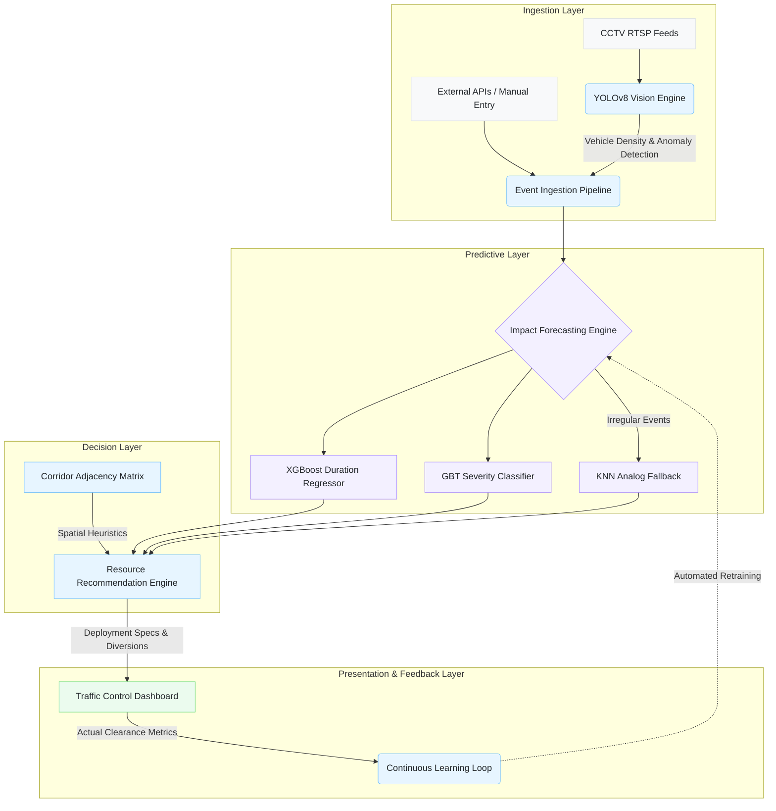

# Namma Route: Event-Driven Congestion Forecasting & Resource Recommendation System

## System Overview

Namma Route is an enterprise-grade Decision Support System (DSS) engineered for municipal traffic command centers. The platform shifts traffic management from a reactive operational model to a predictive one by integrating computer vision, machine learning forecasting, and heuristic-based resource allocation. 

The primary objective is to accurately predict the spatial and temporal fallout of localized traffic events (e.g., accidents, vehicular breakdowns, construction, public gatherings) and automate the deployment of emergency resources and diversion protocols before systemic gridlock occurs.

## Process Flow Architecture



## Component Architecture

### 1. Computer Vision Ingestion (YOLOv8)
Processes live or simulated junction feeds to detect static anomalies (breakdowns, accidents) and high vehicle density. The vision engine operates autonomously, bypassing the need for manual event entry and minimizing system latency.

### 2. Impact Forecasting Engine (Scikit-Learn / XGBoost)
Executes real-time inference on incoming event vectors. 
- **Severity Classification:** Gradient Boosted Trees classifier utilizing categorical features (cause, day, time period, road closure) to categorize impact magnitude.
- **Duration Regression:** XGBoost regressor predicting absolute clearance time. The target variable is log-transformed during training to account for the heavy right-tail distribution of prolonged events.
- **Analog Fallback (KNN):** Standard regression models typically underperform on highly irregular planned events (e.g., major political rallies). The system implements a K-Nearest Neighbors fallback utilizing Cosine Similarity to extract the median clearance time of the 5 most historically similar past events.

### 3. Resource Recommendation Engine
A deterministic heuristic layer that translates ML outputs into actionable operations. It cross-references the predicted severity against a predefined resource matrix to allocate personnel, barricades, and specialized vehicles (e.g., Heavy Tow Trucks). Furthermore, it calculates optimal alternate diversion corridors utilizing a pre-computed Haversine spatial adjacency matrix.

### 4. Continuous Learning Loop
A feedback mechanism allowing ground officers to input actual clearance times post-resolution. The system aggregates this telemetry data to periodically retrain the underlying forecasting models, ensuring the system adapts to evolving civic infrastructure and traffic patterns.

## Local Installation & Configuration

### Prerequisites
- Python 3.9+
- Valid Mappls (MapmyIndia) API Key

### Setup Instructions

1. **Clone the Repository:**
```bash
git clone https://github.com/your-username/namma-route.git
cd namma-route
```

2. **Install Dependencies:**
```bash
pip install -r requirements.txt
```

3. **Configure Environment Variables:**
Create a `.env` file in the root directory:
```env
MAPPLS_API_KEY=your_production_api_key_here
```

4. **Launch Application:**
The project includes a launch script that concurrently initializes the FastAPI backend and the background event simulator.
```bash
chmod +x run_demo.sh
./run_demo.sh
```

The dashboard will be available at: `http://localhost:8000`

## Production Deployment (Docker / Hugging Face Spaces)

The application is containerized for zero-configuration deployment on platforms supporting Docker infrastructure.

### Deployment Protocol
1. Initialize a Docker-compatible environment (e.g., Hugging Face Spaces).
2. Sync the repository contents.
3. Configure environment secrets:
   - Variable Name: `MAPPLS_API_KEY`
   - Value: `[Your API Key]`
4. The `Dockerfile` executes the following sequence:
   - Installs requisite Linux graphics dependencies (`libgl1`, `libglib2.0-0`) for headless OpenCV execution.
   - Executes `backend/forecasting.py` to compile and pickle the ML models locally, preventing cross-version Pandas unpickling errors.
   - Exposes port `7860` and initiates `start_prod.sh`.

---
*Technical Prototype Developed for Flipkart Gridlock 2.0*
