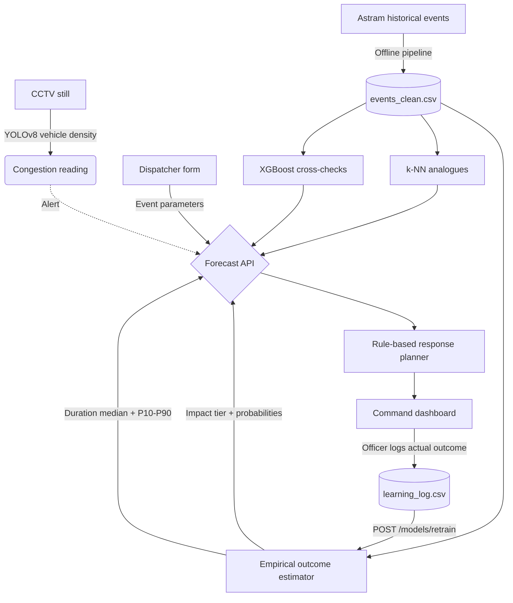

<div align="center">
  

  # Namma Route
  ### Event-driven congestion forecasting and response planning for the Bengaluru Traffic Police

  [](https://huggingface.co/spaces/aynaval2003/namma-route)
  [](https://fastapi.tiangolo.com/)
  [](https://ultralytics.com)
  [](#)
</div>

---

> **Flipkart Gridlock 2.0 prototype.** A decision-support dashboard that turns a
> traffic event into a resourcing decision: how bad is this likely to be, how long
> will it take to clear, how many officers and barricades to send, and where to
> divert traffic.

👉 **[Live dashboard](https://huggingface.co/spaces/aynaval2003/namma-route)**

---

## What it actually does, and how well

We would rather state this plainly up front than bury it.

| Question | Answer | How good |
| :--- | :--- | :--- |
| How severe will this event be? | Low / Medium / High impact tier | **51.5%** accuracy vs a **40.0%** majority-class baseline |
| How long until it clears? | Median + P10–P90 range, with the sample it rests on | **MAE 84.9 min**, median AE **29.0 min**; interval covers **76.8%** of outcomes |
| How many officers and barricades? | Explicit rule table | Not learned — the dataset has no deployment ground truth |
| Where should traffic divert? | Two or three nearest corridors, hour-aware | Centroid distance; ignores real road connectivity |
| Is anything happening on camera? | Vehicle density per frame | A counter with a threshold, not incident detection |

The severity model beats the baseline by about eleven points. That is a real but
modest signal, and it is what this dataset supports once the target is defined
honestly. The reasoning is in [`ASSUMPTIONS.md`](ASSUMPTIONS.md); the short version
is below.

### Why the headline number is not 91%

An earlier version of this project reported **91.4%** severity accuracy. That number
was an artefact and has been removed.

The label was `severity_tier = priority`, and `priority` is an administrative flag
that is High for every event on a named arterial corridor and Low everywhere else —
a rule that holds for **99.84%** of rows. The model was not predicting severity; it
was recovering "is this on a main road?" from the coordinates that define it. Ablation:

| Feature set | Accuracy |
| :--- | ---: |
| Majority-class baseline | 0.6174 |
| All features (the reported 91%) | 0.9299 |
| Without latitude, longitude, junction, police station | 0.6458 |
| Cause + time + closure — the features the old README credited | 0.6402 |

Dropping the `corridor` column, which the old code did deliberately, changed nothing:
7,162 distinct coordinate pairs across 8,057 rows let the trees reconstruct corridor
boundaries geometrically.

`severity_tier` is now derived from the observed outcome instead:

- **High** — required a road closure, or took more than 90 minutes to clear
- **Medium** — cleared in 30–90 minutes
- **Low** — cleared in under 30 minutes

This is only defined for the 2,523 events with a measured duration, so that is what
the models train on. `evaluate_metrics.py` re-runs the ablation on every invocation
so the leak cannot come back unnoticed.

---

## Architecture



### The estimator

Duration **and** severity are read off one hierarchical empirical distribution that
backs off through progressively coarser strata until it finds one with at least 20
observations:

```
(cause, corridor)  →  (cause, road_closure)  →  (cause)  →  global
```

Two reasons this is not gradient boosting:

1. **It is at least as accurate.** On a held-out split: empirical MAE 84.9, per-cause
   median 84.8, XGBoost 85-ish, global median 87.6. The duration target measures
   *administrative ticket closure*, which trails actual clearance by days for
   potholes and waterlogging, so there is very little learnable structure. A one-line
   `groupby` matches the boosted model, and the honest response is to say so rather
   than ship the more impressive-sounding one.
2. **The two outputs cannot contradict each other.** When severity was a separate
   classifier it returned *"High, 99% confidence"* for an event whose duration
   estimate was 19 minutes — Low by the very definition severity is derived from.
   Reading both from one distribution makes that structurally impossible, and it
   is also more accurate (51.5% vs 46.3%) with far better calibration: mean top
   probability 0.505 against an observed accuracy of 0.515.

XGBoost classifier and regressor are still trained and served alongside as
`model_severity_tier` and `model_duration_min`, with their metrics published in
`/models/metrics`, so the comparison is visible rather than asserted.

### The response planner

A rule table keyed on `(cause, severity, road_closure)` returning officer counts,
barricade counts and an action checklist. **Not learned** — the dataset has no record
of what was actually deployed — and every response says so. All 55 rules have both a
closure and a non-closure variant, so asking for a High-severity plan without a
closure returns lane-control actions rather than instructions to close the road.

### The learning loop

Officers log the actual outcome; `POST /models/retrain` folds those rows back into
the training set, recomputes severity from the corrected duration, retrains and
hot-swaps the models without a restart. The dashboard shows live accuracy computed
from logged feedback, separately from the offline benchmark, each labelled as what
it is.

---

## Dataset

Anonymised Bengaluru traffic-event log, Nov 2023 – Apr 2024.

- 8,173 raw rows → **8,057** after dropping rows with no start timestamp
- **2,523** (31%) have a measured clearance duration; only these can be labelled
- 61% are `vehicle_breakdown`. The event-driven causes the brief is about are thin:
  66 processions, 45 public events, 14 protests, 4 VIP movements. Forecasts for
  those lead with historical analogues and are flagged `is_sparse_cause`.
- Events cluster between 19:00 and 08:00 IST. That is a **patrol-shift artefact**,
  not an incident-rate curve, and the API says so in `/events/distributions`.

---

## Running it

### Local

```bash
pip install -r requirements.txt
echo "MAPPLS_API_KEY=your_key_here" > .env   # optional; only the map needs it
./run_demo.sh                                 # builds data + models if missing
```

Dashboard at **http://localhost:7860**. Add `ENABLE_SIMULATOR=1` to replay a
simulated event stream — it is off by default so it cannot quietly inflate the
learning log.

### Pipeline

```bash
python3 backend/data_cleaning.py     # raw CSV -> events_clean.csv + corridor geography
python3 backend/forecasting.py       # train and save models
python3 backend/forecasting.py --feedback   # retrain including officer feedback
python3 evaluate_metrics.py          # metrics vs baselines + leakage audit
```

### Docker

```bash
docker build -t namma-route . && docker run -p 7860:7860 namma-route
```

The image runs both the cleaning and training steps at build time, so the container
never depends on committed artefacts and cannot hit cross-version unpickling errors.

---

## Known limitations

- **Duration measures ticket closure, not clearance.** Some events sit open for days
  after the road is usable. This caps how well any model can do, and is why the UI
  shows a range with a dispersion warning rather than a confident point estimate.
- **Severity is only defined for 31% of rows.** The rest appear in the dashboard as
  "no measured outcome" and are excluded from training.
- **Resource counts are not validated.** No ground truth for deployment exists in the
  data. They are anchored to closure rates, duration tiers and standard practice.
- **Diversions ignore road connectivity.** Centroid-to-centroid haversine distance;
  two corridors can be close by centroid without being connected.
- **The CV layer detects density, not incidents.** A single frame cannot distinguish
  stopped traffic from moving traffic. Stationarity across frames is the upgrade path.
- **Reporting bias is unmodelled.** Hour-of-day features partly encode patrol shifts.
