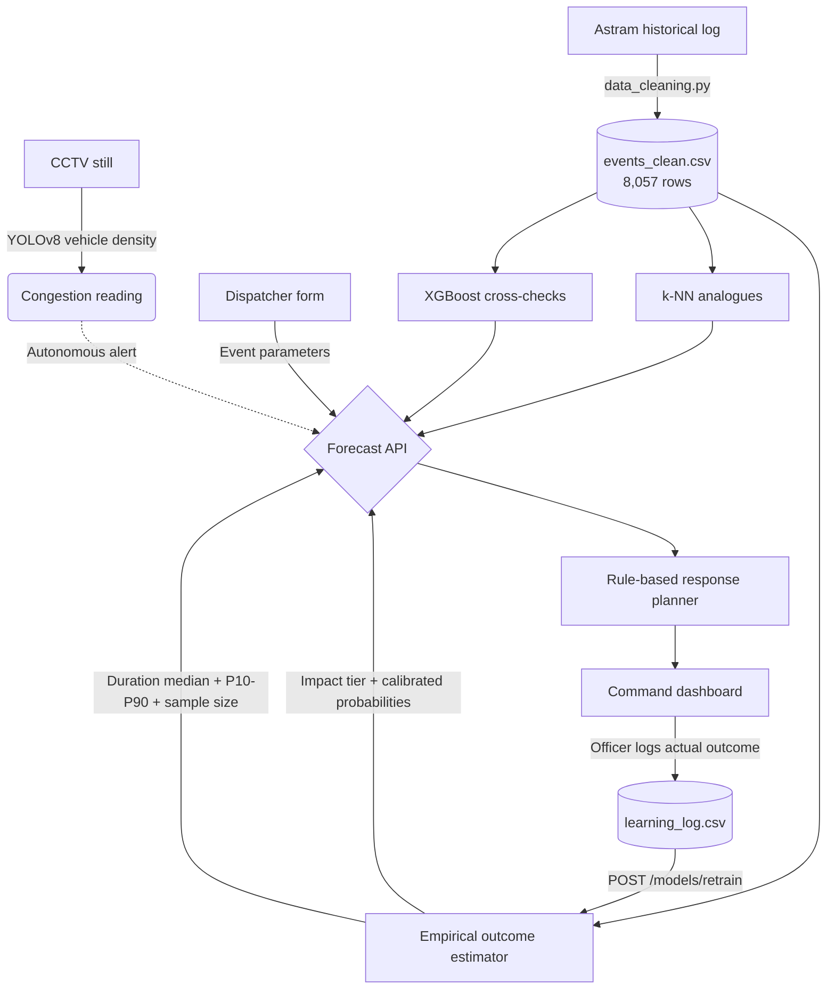

# Namma Route: System Architecture

How the system is put together, and why the modelling choices are what they are.
Metrics quoted here are reproduced by `python3 evaluate_metrics.py`.

---

## 1. Flow



---

## 2. The four layers

### A. Data foundation — `backend/data_cleaning.py`

8,173 raw rows → 8,057 after dropping rows with no start timestamp.

- Timestamps parsed and converted to IST before deriving `hour_of_day`,
  `day_of_week`, `is_weekend`, `is_peak_hour`, `is_night`, `time_bin`.
- `duration_to_close_min` = `closed_datetime − start_datetime`, valid in
  `(0, 1440]`. Available for **2,523** rows (31%).
- `severity_tier` derived from the outcome — High if a closure was required or it
  took over 90 min, Medium 30–90, Low under 30. Only defined where duration is known.
- `priority` is retained as a separate, honestly-labelled BTP corridor-priority flag.
- Rare causes (< 5 occurrences) merged into `others`.
- `event_span_km` capped at 10 km.
- Corridor centroids **and** the top-5 haversine adjacency table are both written here.

### B. Forecasting — `backend/forecasting.py`

**Primary: hierarchical empirical outcome estimator.** Duration and severity are read
off the same conditional distribution, backing off until a stratum has ≥ 20 samples:

```
(cause, corridor)  →  (cause, road_closure)  →  (cause)  →  global
```

Returns a duration median with P10/P25/P75/P90, the sample size behind it, and
severity probabilities as the observed class mix (Laplace-smoothed).

Two reasons this is primary over gradient boosting:

- **No accuracy cost.** Empirical MAE 84.9 vs XGBoost ~85 vs per-cause median 84.8 vs
  global median 87.6. The duration target measures administrative ticket closure, not
  clearance, so there is very little learnable structure and every method ties.
- **Internal consistency.** A separate classifier could return "High, 99% confidence"
  next to a 19-minute duration estimate — Low by the definition severity derives from.
  One distribution makes that impossible, and is also more accurate (51.5% vs 46.3%)
  and far better calibrated (mean top probability 0.505 vs observed accuracy 0.515).

**Cross-checks, trained and served alongside:** an XGBoost 3-class classifier
(`model_severity_tier`) and an XGBoost log-target regressor (`model_duration_min`).
Metrics for both are published at `/models/metrics`.

**k-NN analogues:** cosine nearest neighbours over the encoded feature space,
returning a real median and P10–P90 across 25 neighbours plus the 5 closest events.

**Leakage guard:** `requires_road_closure` is excluded from severity features because
it is part of the label. `evaluate_metrics.py` re-runs the ablation and fails loudly
if removing geography ever costs more than 0.20 accuracy.

### C. Computer vision — `backend/cv_engine.py`

YOLOv8n filtered to car / motorcycle / bus / truck. Thresholds are **vehicles per
megapixel** and **fraction of frame covered**, so the reading means roughly the same
thing across cameras with different zoom and resolution. Weights are lazy-loaded
behind a lock and resolved from the project root.

Inference runs in a **separate worker process** (`backend/cv_worker.py`). The API
imports xgboost and scikit-learn at startup; the vision engine imports torch. Each
ships its own OpenMP runtime, and loading one after the other then entering a parallel
region from a request thread aborts the whole process on macOS — the endpoint hangs and
takes the server down with no traceback. Isolating inference also means torch never
loads in the web process, and a native crash in the CV stack costs one worker rather
than the API. The worker is warmed in a background thread at startup so boot stays fast
and the first camera click does not pay the cold start.

This is a density signal, not incident detection — a single frame cannot separate
stopped traffic from moving traffic. Every response carries a `method_note` saying so.

### D. Response planner & UI — `backend/recommendations.py`, `frontend/`

55 rules keyed on `(cause, severity, road_closure)`, each with a documented basis.
Every `(cause, severity)` pair has both closure and non-closure variants, and the
fallback chain never escalates severity. Diversions come from the corridor adjacency
table and are hour-aware.

Frontend is vanilla JS with Chart.js and the Mappls SDK. All dataset-derived text is
HTML-escaped. Chart aggregations are computed server-side at `/events/distributions`.

---

## 3. API surface

| Endpoint | Purpose |
| :--- | :--- |
| `GET /events`, `/events/summary`, `/events/distributions` | Historical data and pre-aggregated chart series |
| `GET /hotspots`, `/hotspots/geo`, `/corridors` | Spatial aggregates and geography |
| `POST /forecast` | Severity tier, duration interval, resource plan, diversions, analogues |
| `POST /feedback`, `GET /feedback/log` | Learning loop; live metrics over scorable rows only |
| `POST /models/retrain`, `GET /models/retrain/status` | Retrain including feedback, hot-swap |
| `GET /models/metrics` | Offline metrics with baselines |
| `POST /vision/analyze`, `GET /vision/junction/{id}` | CCTV analysis (8 MB upload cap) |
| `GET /alerts/live`, `/alerts/live/{id}/image` | Alert metadata; frame fetched separately |
| `GET /health`, `/config` | Status and client configuration |

---

## 4. Stack

| Layer | Technologies |
| :--- | :--- |
| Modelling | pandas, NumPy, scikit-learn, XGBoost |
| Computer vision | YOLOv8 (Ultralytics), OpenCV, PyTorch |
| API | FastAPI, Uvicorn, Python 3.10 |
| Frontend | HTML5, CSS3, vanilla JS, Chart.js, Lucide |
| Mapping | Mappls (MapmyIndia) SDK |
| Deployment | Docker, Hugging Face Spaces |

All dependencies are pinned. The Docker image runs cleaning and training at build
time, so the container never depends on committed artefacts.
