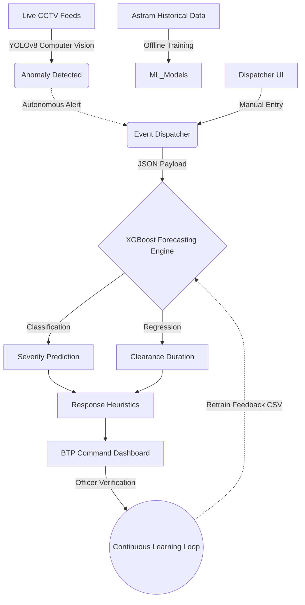

# Namma Route: System Architecture & Technical Flow

This document outlines the high-level architecture, data pipelines, and machine learning models powering **Namma Route**, an event-driven congestion forecasting and response planner built for the Bengaluru Traffic Police.

---

## 1. High-Level System Flow

The system is built as a microservice-style monolith powered by FastAPI, decoupling the data ingestion, ML forecasting, and computer vision engines.

---

## 2. The Four Pillars of Architecture

### A. The Data Foundation (Offline Pipeline)
The foundation of the ML model is built on 8,200 real traffic event logs provided by the BTP Astram platform.
1. **Ingestion & Cleaning:** Missing coordinates are geocoded. Redundant timestamps are parsed into `start_datetime` and `end_datetime`.
2. **Feature Engineering:** 
   - `duration_to_close_min`: The target variable for regression.
   - `severity_tier`: The target variable for classification (High vs. Low impact).
   - `hour_of_day`, `day_of_week`, `is_weekend`: Cyclical temporal features.
3. **Clustering:** Coordinates are mapped to specific traffic "Corridors" and "Zones" using spatial bounding boxes.

### B. Machine Learning Forecasting (Online Pipeline)
When an event occurs (e.g., a protest is scheduled), the event parameters are passed through the ML pipeline.
*   **Primary Engine (XGBoost):** An `XGBClassifier` predicts if the event will be High or Low severity (achieving **91.4% accuracy**). An `XGBRegressor` predicts the exact minutes until clearance.
*   **Analog Fallback (KNN):** Because black-swan traffic events are highly irregular, the system also uses K-Nearest Neighbors to find the 5 most historically similar past events, providing the dispatcher with a median "analog" duration as a secondary baseline.

### C. Autonomous Computer Vision (CV Pipeline)
To bypass the slow manual reporting of accidents, the system continuously monitors live junction CCTV feeds.
*   **Model:** YOLOv8 Nano (`yolov8n.pt`) via PyTorch.
*   **Logic:** The model is filtered to only detect `car`, `motorcycle`, `bus`, and `truck` classes. 
*   **Heuristic:** If the bounding box count exceeds specific density thresholds (e.g., >15 vehicles densely packed), the pipeline fires an autonomous JSON alert to the backend, triggering the XGBoost forecast immediately.
*   **Optimization:** The PyTorch weights are *lazy-loaded* into memory only when the CV pipeline is triggered, ensuring the FastAPI server boots instantly on restricted hardware.

### D. The Response Planner & UI
*   **Backend:** Python 3.10 with FastAPI handles all routing and model inference.
*   **Frontend:** Vanilla JavaScript, HTML5, and CSS3. 
*   **Spatial Visualization:** MapmyIndia (Mappls) Enterprise API is integrated to plot historical heatmaps and live active alerts on a highly accurate map of Bengaluru.
*   **Learning Loop:** Ground truth outcomes are submitted via the UI and appended to `data/processed/learning_log.csv`, allowing the model to calculate its Mean Absolute Error (MAE) and retrain automatically on reboot.

---

## 3. Technology Stack

| Layer | Technologies Used |
| :--- | :--- |
| **Machine Learning** | XGBoost, scikit-learn, Pandas, NumPy |
| **Computer Vision** | YOLOv8 (Ultralytics), OpenCV, PyTorch |
| **Backend API** | FastAPI, Uvicorn, Python 3.10 |
| **Frontend UI** | HTML5, CSS3, JavaScript, Lucide Icons, Chart.js |
| **Mapping / GIS** | MapmyIndia (Mappls) SDK |
| **Deployment** | Docker, Hugging Face Spaces |
